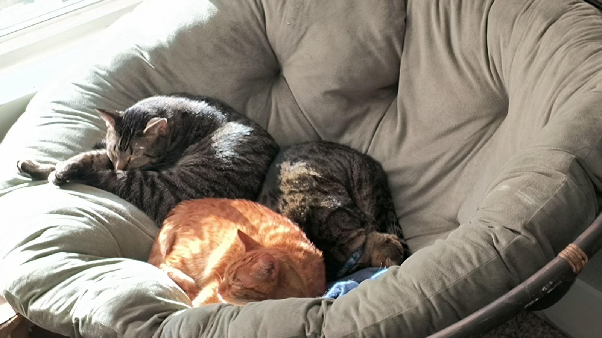

# About Me
My name is Cailey Cassity-Ness (Ness), and I use she/her/hers pronouns. I was born in Las Vegas, Nevada, and lived there until my dad retired from the Air Force, which led to me moving to Crestview, Florida in 2008. I stayed in Florida until attending Millsaps College in Jackson, Mississippi, and after a brief detour in Texas, I am finally back to living in the sunshine state. 

I'm currently a first-year doctoral student in the [Texts and Technology PhD program](https://cah.ucf.edu/textstech/) at the University of Central Florida. I intend to use my experiences from this program to pursue game studies and fan studies, but I also have a love for rhetoric (particularly classical rhetoric) as well. Right now, I am trying to keep my research interests open as I learn new things in the Digital Humanities field.

I have worked in higher education since 2022, where I have served as both staff and faculty in various positions. Currently, I am an remote, part-time instructor of English at Blinn College in Bryan, Texas, along with serving as Program Coordinator for Rollin College's Center for Career & Life Planning. Recently, I've found that having a role that incorporates teaching, research, and community engagement would be my ideal career "final destination," which is something I realized after serving as Co-Lead Writer for Rollins College's 2026 [Carnegie Foundation Community Engagement Reclassification](https://carnegieclassifications.acenet.edu/elective-classifications/community-engagement/). Seeing (and writing) about all the impressive work faculty and staff have done at Rollins helped push me toward continuing my graduate studies. 

Outside of work and education, I am a big fan of board games, cozy video games, and reading. I live with my spouse, our two dogs Reggie and Dandelion, and our three cats Marvin, Mau, and Baker. 
## Reggie (left) and Dandelion (right)

## Marvin (left gray), Mau (right gray), and Baker (orange)

If you want to know more, I'd love to have a conversation with anyone interested, and you are welcome to reach out via email to Cailey.Cassity-Ness@ucf.edu.